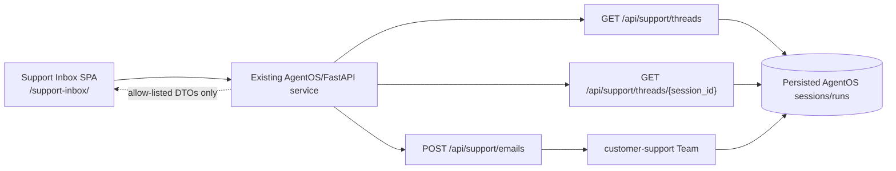

# Customer Support Inbox Frontend Plan

**Change name:** `customer-support-inbox`

Build a local-development-first React inbox for inspecting persisted Customer Support conversations and sending simulated customer emails. The inbox is served by the existing AgentOS/FastAPI process at `/support-inbox/`; it adds no production service and does not expose approval controls or internal agent execution data.

## Quick path

1. Add a React + TypeScript + Vite SPA whose production build is mounted by the existing FastAPI application at `/support-inbox/`.
2. Add three narrow, allow-listed backend endpoints that derive inbox DTOs from persisted `customer-support` sessions and runs.
3. Render only safe, normalized email data in a responsive list/detail inbox; send new simulated emails using the selected thread's canonical session ID.
4. Verify DTO filtering, endpoint behavior, responsive UI states, and the existing Customer Support integration boundary.

## Decisions at a glance

| Topic | Decision |
|---|---|
| Frontend | React + TypeScript + Vite SPA, served from the existing AgentOS/FastAPI service under `/support-inbox/`. |
| First release scope | Local-development-first; production authentication is not part of the first slice. |
| Data source | Persisted AgentOS Customer Support sessions and runs, transformed into explicit inbox DTOs. |
| Browser boundary | Never proxy raw member responses, tool traces, reasoning, approval tool arguments, or generic persisted run payloads. |
| Send identity | `thread_id` is the canonical `session_id` used to run the Customer Support team. |
| Approval boundary | The UI can show a non-sensitive pending status but cannot resolve or resume HITL approvals. |
| Detail views | Exactly two tabs: HTML-safe presentation and normalized JSON. |
| Layout | Desktop two-column inbox; mobile list/detail navigation, based on the supplied screenshot. |
| Deployment | Do not add a second production service. |

## Architecture



The backend is the security and compatibility boundary. It selects only runs for the `customer-support` team, parses only the typed customer input and final reply shapes that the inbox needs, and maps them to response DTOs. It must not serialize a framework session or run object directly.

`support_interaction` records remain an analytics input for Support Insights. They are insufficient as inbox data because they only retain completed interaction metadata, not the complete inbound email, outbound reply, or paused-thread state needed to display a conversation.

## Data and DTO boundary

### Source selection

The read service must:

- Select persisted AgentOS sessions and runs belonging to `team_id="customer-support"`.
- Reconstruct inbound messages from the validated `CustomerEmail` run input and outbound messages from the final `CustomerEmailReply` content.
- Preserve chronological ordering using persisted run timestamps.
- Derive a safe thread status from run state, such as `completed` or `approval_pending`, without returning requirement details.
- Skip or mark unavailable malformed/legacy records rather than falling back to a raw payload response.

### Public DTOs

Use explicit Pydantic response models (or equivalent typed DTOs) with an allow-list of fields. The names below are the browser contract; internal persistence shapes remain private.

```text
ThreadSummary
  session_id: string
  subject: string
  customer_email: string
  preview: string
  last_message_at: ISO-8601 timestamp
  status: completed | approval_pending | incomplete

ThreadDetail
  session_id: string
  status: completed | approval_pending | incomplete
  messages: InboxMessage[]

InboxMessage
  message_id: string
  direction: inbound | outbound
  from_email: string
  subject: string
  body: string
  sent_at: ISO-8601 timestamp
  category?: string
  issue_code?: string
  outcome?: string
```

Only an outbound message may carry the normalized `category`, `issue_code`, and `outcome` supplied by `CustomerEmailReply`. These are presentation metadata, not approval metadata.

The mapper must explicitly reject or omit all of the following from DTOs: member-agent output, `tool_calls`, tool results and traces, model reasoning, `requirements`, approval IDs, approval statuses beyond the coarse `approval_pending` thread status, and approval tool arguments.

## API contracts

### `GET /api/support/threads`

Return the inbox list in most-recent-first order.

```json
{
  "threads": [
    {
      "session_id": "THREAD-1001",
      "subject": "Where is my order?",
      "customer_email": "alice@example.test",
      "preview": "Please share the tracking status...",
      "last_message_at": "2026-08-27T10:15:00Z",
      "status": "completed"
    }
  ]
}
```

This endpoint is intentionally a summary view. It does not return message bodies, run IDs, or framework persistence objects.

### `GET /api/support/threads/{session_id}`

Return the normalized messages for one Customer Support session. Return `404` when the session does not exist, does not belong to `customer-support`, or has no safely mappable inbox data.

```json
{
  "session_id": "THREAD-1001",
  "status": "completed",
  "messages": [
    {
      "message_id": "EMAIL-1001",
      "direction": "inbound",
      "from_email": "alice@example.test",
      "subject": "Where is my order?",
      "body": "Please share the tracking status for ORD-LUMEN-1001.",
      "sent_at": "2026-08-27T10:14:00Z"
    },
    {
      "message_id": "EMAIL-1001",
      "direction": "outbound",
      "from_email": "support@example.test",
      "subject": "Tracking update",
      "body": "Your order is in transit.",
      "sent_at": "2026-08-27T10:15:00Z",
      "category": "order",
      "issue_code": "tracking_request",
      "outcome": "answered"
    }
  ]
}
```

### `POST /api/support/emails`

Accept one simulated email and execute `customer-support`. The request uses `thread_id` as the canonical session identifier: the backend must call the team with `session_id = request.thread_id`, with no independently generated or substituted session ID. For a reply in an existing thread, the UI sends that thread's `session_id` as `thread_id`; for a new conversation, the UI generates a new thread ID first.

```json
{
  "thread_id": "THREAD-1001",
  "message_id": "EMAIL-1002",
  "from_email": "alice@example.test",
  "subject": "Re: Where is my order?",
  "body": "Thank you. Can you also confirm the delivery date?"
}
```

Validate the email fields with the existing `CustomerEmail` contract. A completed run returns the resulting safe `ThreadDetail` or a safe send result followed by a detail refresh. A paused approval returns `202 Accepted` with only `session_id`, `run_id`, and `status: "approval_pending"`; it must not return requirements, approval IDs, tool names, or tool arguments. The SPA does not call any continuation or approval endpoint.

Use conventional client-error responses for invalid input and a generic server error for an execution failure. Never include a raw exception, run payload, or trace in an error response.

## UI requirements

### Inbox behavior

- Use the supplied screenshot as the visual layout reference, not as an API or data-model contract.
- On desktop, show a two-column layout: scrollable thread list on the left and the selected thread detail on the right.
- On mobile, show either the list or the selected detail. Detail includes an explicit back control to return to the list.
- Show an empty state when no safely mappable Customer Support sessions exist and a selected-thread empty state when appropriate.
- Show loading, request-failure, and send-in-progress states without replacing existing safe thread content.
- Include a compose/reply form for simulated emails. It validates required fields and generates a bounded unique `message_id`; replies preserve the selected `session_id` through `thread_id`.
- When a send returns `approval_pending`, show a neutral pending notice. Do not render an approval action, approval metadata, or a resume control.

### Detail tabs and rendering safety

The detail view has exactly two tabs:

1. **Email** — an HTML-safe presentation of the normalized message DTOs.
2. **JSON** — pretty-printed normalized `ThreadDetail` JSON for local development inspection.

Render model-originated `subject`, `body`, and metadata as text. React's normal escaping is the default; any formatting layer must sanitize its output. Model content is never assigned directly to `innerHTML`, including through `dangerouslySetInnerHTML`. The JSON tab serializes the already-normalized DTO, never a framework run, tool result, or raw API persistence object.

## Serving and local development

- Keep the SPA source in a dedicated frontend directory and configure Vite with `base: "/support-inbox/"` so generated asset URLs work beneath the FastAPI mount.
- Build the SPA into a static directory served by the existing FastAPI application at `/support-inbox/`.
- Keep API routes under `/api/support/` in the same application process. Mount and router ordering must allow the API endpoints to remain reachable.
- The first slice is local-development-first. It does not introduce browser login, role design, production credential storage, a production auth bypass, or a public deployment promise. Existing runtime-wide authorization behavior remains unchanged.
- Do not introduce a separate Node, reverse-proxy, or frontend production service. Node/Vite is a local build tool only; the built assets ship with the existing AgentOS service.

## Implementation sequence

1. Define backend inbox DTOs and a read mapper over persisted Customer Support sessions/runs. Add strict allow-list tests before wiring routes.
2. Add the three FastAPI endpoints and invoke the existing `customer_support` team from the send endpoint using `session_id = thread_id`.
3. Mount the built SPA under `/support-inbox/` in `app/main.py` without changing the existing AgentOS service topology.
4. Scaffold the Vite React application, configure the `/support-inbox/` base path, and implement the typed API client.
5. Implement responsive list/detail navigation, compose/reply behavior, loading and error states, and the two safe detail tabs.
6. Add focused backend and frontend tests, then run the integration checks in an isolated environment.

## Expected files

| File | Planned responsibility |
|---|---|
| `app/support_inbox.py` | Inbox DTOs, persisted-run mapper, and the three narrow FastAPI routes. |
| `app/main.py` | Include the support API router and mount built static assets at `/support-inbox/`. |
| `tests/test_support_inbox.py` | Mapper, API contract, filtering, and no-sensitive-field regression coverage. |
| `frontend/support-inbox/package.json` | Frontend scripts and dependencies. |
| `frontend/support-inbox/vite.config.ts` | Vite configuration with the `/support-inbox/` base path. |
| `frontend/support-inbox/src/api.ts` | Typed client for the three inbox endpoints. |
| `frontend/support-inbox/src/App.tsx` | Inbox application state, responsive navigation, and compose flow. |
| `frontend/support-inbox/src/components/*` | Thread list, detail, tabs, message presentation, and compose components. |
| `frontend/support-inbox/src/*.css` | Screenshot-aligned responsive layout and states. |
| `frontend/support-inbox/src/**/*.test.tsx` | Component and client behavior tests. |

The exact component split may stay small, but the frontend must remain isolated from Python runtime internals and consume only the documented DTOs.

## Test strategy

| Layer | Coverage |
|---|---|
| DTO mapper | Selects only `customer-support` sessions, preserves chronology, derives safe status, and excludes all forbidden internal fields. |
| API | Validates list/detail/send contracts, `404` isolation, `thread_id` to `session_id` mapping, completed responses, and `202 approval_pending` without approval details. |
| Backend integration | Confirms a simulated send uses the existing typed Customer Support input/output contract without adding a second service. |
| Frontend unit/component | Covers list/detail selection, mobile back navigation, empty/loading/error states, compose validation, and the two-tab limit. |
| Rendering security | Asserts model-originated content is rendered as text and no direct `innerHTML`/`dangerouslySetInnerHTML` path exists. |
| Build/static serving | Builds Vite assets and verifies `/support-inbox/` and its base-path assets are served by the FastAPI app. |

The existing Customer Support smoke path is model-backed and writes shared PostgreSQL state. Run it only when there is exclusive shared-DB writer safety; concurrent real use can otherwise be mistaken for test-created state and swept by cleanup. Deterministic mapper, route, and frontend tests are the normal development feedback loop.

## Acceptance criteria

- [ ] `/support-inbox/` loads a React + TypeScript + Vite SPA from the existing AgentOS/FastAPI service.
- [ ] The SPA shows persisted `customer-support` threads in desktop two-column and mobile list/detail layouts.
- [ ] `GET /api/support/threads`, `GET /api/support/threads/{session_id}`, and `POST /api/support/emails` are the only inbox-specific browser endpoints.
- [ ] Inbox DTOs are built from persisted sessions/runs and expose no raw framework or internal agent execution data.
- [ ] `thread_id` is passed unchanged as the Customer Support run `session_id`.
- [ ] The UI can send simulated emails and refresh the safe thread detail.
- [ ] A paused refund is represented only as a safe pending state; the UI cannot resolve or resume HITL approvals.
- [ ] Detail has exactly Email and JSON tabs; all model-originated content is escaped/sanitized and never directly assigned to `innerHTML`.
- [ ] No second production service, production authentication system, or raw AgentOS proxy is introduced.
- [ ] Focused tests cover the API boundary, rendering safety, and responsive interaction states.

## Out of scope

- Production authentication, authorization, customer identity verification, and public deployment hardening.
- Resolving, rejecting, resuming, or inspecting HITL approval requirements from the inbox.
- Displaying member responses, tool calls, traces, reasoning, approval arguments, or raw AgentOS run/session JSON.
- Replacing Support Insights or using `support_interaction` as the inbox's primary conversation store.
- A second production frontend/backend service, a reverse proxy, or a browser-to-AgentOS generic proxy.
- Rich-text or arbitrary HTML rendering, attachments, search, pagination, real email delivery, and multi-user collaboration.
