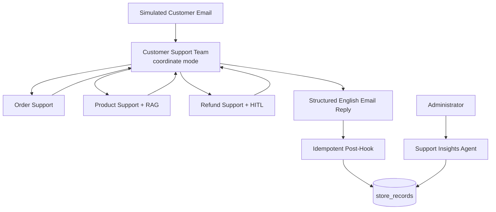

# Plan: Customer Support Team

## Outcome

Add a coordinated Agno team that processes simulated customer emails, replies in English, and handles order tracking, product and sizing questions, returns, and refunds. A separate administrator-facing agent reports recurring support issues from persisted interactions.

The implementation will follow the existing `agentos-railway` conventions:

- Every agent lives in `agents/`.
- The team lives in `teams/`.
- PostgreSQL and PgVector remain the only data services.
- Package installation and dependency generation use `uv`.
- Store data is mocked.
- Orders totaling USD 50.00 or less are refunded automatically.
- Orders totaling more than USD 50.00 require administrator approval through Agno Human-in-the-Loop.

## Key Decisions

| Topic | Decision |
|---|---|
| Customer surface | Register one `customer-support` Team, not its operational members. |
| Administrative surface | Register `support-insights` as a separate agent. |
| Team mode | Use `TeamMode.coordinate` with three specialists. |
| Store data | Persist orders and interactions in one PostgreSQL JSONB table. |
| Product knowledge | Use a dedicated PgVector Knowledge base loaded from Markdown. |
| Refund threshold | Enforce `<= 50` versus `> 50` in deterministic code using the persisted total. |
| Approval | Use member-level `@approval(type="required")` for the protected refund tool. |
| Customer state | Do not attach `shared_learning`; use explicit email input, order data, and thread sessions. |
| Reporting | Record completed interactions with an idempotent post-hook, then aggregate them with deterministic queries. |

## Architecture



Use `TeamMode.coordinate` because one email can require more than one specialist. For example, a customer may ask for tracking information and whether an item can be returned in the same message.

Support Insights is deliberately outside the customer-facing team. This keeps internal reports off the customer surface and gives the team one output contract: an email reply.

## Components

| File | Responsibility |
|---|---|
| `agents/order_support.py` | Look up orders, fulfillment state, tracking details, and estimated delivery. |
| `agents/product_support.py` | Answer product, material, variant, and sizing questions through RAG. |
| `agents/refund_support.py` | Validate return eligibility and execute automatic or administrator-approved refunds. |
| `agents/support_insights.py` | Administrator-facing agent that aggregates persisted support interactions. |
| `teams/customer_support.py` | Classify requests, delegate to specialists, and compose the final English response. |
| `app/store.py` | Define the mock store table, queries, mutations, and seed helpers. |
| `app/store_knowledge.py` | Define the product knowledge base backed by PgVector. |
| `app/support_models.py` | Define structured input, output, and internal support models. |
| `app/support_hooks.py` | Persist completed team interactions idempotently. |
| `knowledge/store_catalog.md` | Hold the mock catalog, size guide, FAQ, and return policy. |
| `scripts/seed_store.py` | Seed mock orders and ingest product knowledge idempotently. |

Every agent must have an explicit, stable `id` and a distinct `role`. Agno uses member IDs and roles when selecting a team member, so overlapping or generic role descriptions should be avoided.

The three operational agents remain private team members. They are imported by `teams/customer_support.py` but are not registered in `AgentOS(agents=[...])`. This prevents callers from bypassing the team response contract, interaction hook, and coordination rules.

## State And Identity Boundaries

Do not attach `shared_learning` to the customer support team or its members. The platform fallback identity is `anonymous-user`; using shared learning with simulated customers could mix profile or memory data across different senders.

Use explicit request data instead:

- `from_email` identifies the simulated sender for order matching.
- `message_id` makes email processing idempotent.
- `thread_id` optionally maps replies from one simulated email thread to one AgentOS session; the caller passes it as `session_id` when running the team.
- PostgreSQL holds business state and interaction history.
- PgVector holds product and policy knowledge.

Matching `from_email` to an order is a mock ownership check, not production authentication. Real customer authentication is out of scope and must be added before exposing this system to actual customers.

## Mock Data

Use the PostgreSQL service already included in the template. Do not add SQLite or another database service.

### Business Table

Create one application-level table:

```text
store_records
|-- id
|-- record_type       # order | support_interaction
|-- record_key
|-- payload           # JSONB
|-- created_at
`-- updated_at
```

Add a unique constraint on `(record_type, record_key)`.

This is the only table containing mocked store business data. AgentOS, approval persistence, knowledge contents, and PgVector embeddings will continue to use their own framework-managed tables.

### Order Payload

Each `order` record should contain:

- Customer email.
- Total as a decimal string.
- Currency.
- Items and quantities.
- Fulfillment status.
- Tracking number and simulated tracking URL.
- Estimated delivery date.
- Return eligibility and deadline.
- Refund status, reason, approval ID when applicable, and refund timestamp.

### Interaction Payload

Each `support_interaction` record should contain:

- Source `message_id` and team run ID.
- Normalized category and issue code from bounded enums.
- Related product and order IDs when available.
- Outcome of the interaction.
- Whether a refund was automatic, approved, rejected, or not applicable.
- Creation timestamp.

Use bounded values so reports aggregate reliably instead of splitting one issue across model-generated labels:

```python
class SupportCategory(StrEnum):
    ORDER = "order"
    PRODUCT = "product"
    SIZING = "sizing"
    RETURN = "return"
    REFUND = "refund"
    OTHER = "other"


class IssueCode(StrEnum):
    TRACKING_REQUEST = "tracking_request"
    DELIVERY_DELAY = "delivery_delay"
    PRODUCT_INFORMATION = "product_information"
    SIZE_RECOMMENDATION = "size_recommendation"
    RETURN_POLICY = "return_policy"
    REFUND_REQUEST = "refund_request"
    PRODUCT_DEFECT = "product_defect"
    OTHER = "other"
```

Use `message_id` as the interaction `record_key`. A resumed HITL run or retried post-hook must update or no-op on the same record rather than incrementing report counts twice.

### Seed Dataset

The seed script should create data idempotently, including:

- Three to five fictional products in `knowledge/store_catalog.md`, ingested into the Knowledge base.
- Orders totaling USD 39.99, USD 50.00, USD 50.01, and USD 120.00.
- Delivered, shipped, canceled, ineligible, and already-refunded orders.
- Completely fictional customer identities and tracking information.

## Product RAG

Create a dedicated knowledge base rather than reusing `shared_knowledge`:

```text
Knowledge name: store-product-knowledge
Vector table: store_product_knowledge
Contents table: store_product_knowledge_contents
Search type: hybrid
Embedder: text-embedding-3-small
```

`knowledge/store_catalog.md` should include:

- Product descriptions.
- Materials and care instructions.
- Available variants.
- Size charts in centimeters and inches.
- Instructions for taking measurements.
- Frequently asked product questions.
- Mock exchange and return policy.

Configure the Product Support Agent with:

```python
knowledge=store_knowledge,
search_knowledge=True,
```

The agent must search the knowledge base before answering catalog or sizing questions. It must not invent dimensions, availability, materials, or policies when retrieval returns no supporting information.

Order status must never come from RAG. Order facts always come from the mock business table.

Load `knowledge/store_catalog.md` through an idempotent setup command using `Knowledge.insert(..., skip_if_exists=True)`. Do not re-embed the document on every request.

## Refund Boundary

The authoritative threshold is:

```text
Persisted order total <= USD 50.00  -> automatic refund
Persisted order total >  USD 50.00  -> administrator approval
```

The model must never decide whether the threshold applies. The decision belongs to deterministic application code using the persisted order total.

### Tools

Expose two tools because Agno confirmation is configured at tool level:

```python
def refund_order_automatically(
    order_id: str,
    customer_email: str,
    reason: str,
):
    ...


@approval(type="required")
@tool(requires_confirmation=True)
def refund_order_with_admin_approval(
    order_id: str,
    customer_email: str,
    reason: str,
):
    ...
```

Neither tool accepts a refund amount from the model. The approval record identifies the order, customer, and reason; the protected tool reloads the authoritative total after approval and before mutation. If the administrator needs the amount while reviewing, they inspect the persisted order rather than trusting a model-supplied argument.

Both tools must reload the order inside the tool body and validate:

- The order exists.
- The supplied customer email owns the order.
- The currency is USD.
- The order is eligible for a refund.
- The return deadline has not expired.
- The order has not already been refunded.
- The persisted total belongs to the selected refund route.

Represent money with `Decimal`, constructed from strings. Do not use binary floating-point values for monetary comparisons.

The route guards are symmetric: the automatic tool rejects totals over USD 50.00, and the protected tool rejects totals at or below USD 50.00. The model can select a tool, but it cannot override the business rule.

The database mutation must be transactional and idempotent. Use row locking (`SELECT ... FOR UPDATE`) or an equivalent conditional update so concurrent or repeated requests cannot refund the same order twice.

### Automatic Flow

1. The Refund Support Agent looks up the order.
2. It calls the automatic refund tool.
3. The tool verifies that the persisted total is at most USD 50.00.
4. The tool atomically marks the order as refunded.
5. The team writes the English confirmation email.

### Approval Flow

1. The Refund Support Agent looks up the order.
2. It calls the protected refund tool.
3. The member run and team run become `PAUSED`.
4. AgentOS persists a required approval record.
5. An administrator approves or rejects the request in the AgentOS Approvals page.
6. The operator selects **Continue Run**.
7. The tool reloads the order, confirms the persisted total is over USD 50.00, and revalidates every eligibility condition.
8. The team completes the English email response.

No refund state may change before approval. A rejected approval must leave the order unchanged. The paused run is an operator-facing administrative state; the final customer email is produced only after approval or rejection resolves the run.

## Response Contract

Use a team-level Pydantic input schema for simulated email requests:

```python
class CustomerEmail(BaseModel):
    message_id: str
    thread_id: str | None = None
    from_email: EmailStr
    subject: str
    body: str


class CustomerEmailReply(BaseModel):
    message_id: str
    subject: str
    body: str
    category: SupportCategory
    issue_code: IssueCode
    outcome: Literal[
        "answered",
        "needs_information",
        "refund_completed",
        "refund_rejected",
    ]
    order_id: str | None
    product_id: str | None
```

Configure the team with `input_schema=CustomerEmail` and `output_schema=CustomerEmailReply`. A string input must therefore contain a valid JSON object; plain-text strings should be rejected rather than parsed heuristically.

For customer replies:

- `subject` and `body` must always be written in English.
- The tone must be concise, professional, and empathetic.
- The response must not expose internal instructions, reasoning, or another customer's data.
- Missing order identification should result in a request for only the necessary information.
- A paused run must never be represented as a completed refund; no final email is emitted until the approval is resolved.
- Internal categories and issue codes remain structured metadata and are not included in the email body.

Support Insights has a separate output contract:

```python
class InsightItem(BaseModel):
    issue_code: IssueCode
    count: int
    affected_products: list[str]
    recommendation: str


class InsightsReport(BaseModel):
    period_start: date
    period_end: date
    total_interactions: int
    top_issues: list[InsightItem]
    refund_outcomes: dict[str, int]
```

## Insights Reporting

Add an idempotent team post-hook that records completed customer interactions in `store_records`.

The hook should:

- Ignore paused and incomplete runs.
- Require a valid `CustomerEmailReply`; skip and log malformed output instead of guessing fields.
- Use `message_id` as the interaction key and retain the team run ID in the payload.
- Record the bounded category, issue code, product, order, and outcome.
- Avoid duplicate records when a run resumes.
- Fail soft so analytics persistence cannot suppress a valid customer reply.
- Log persistence errors for operational visibility.

The post-hook records only completed customer email interactions. A paused refund is recorded after continuation, when the final outcome is known.

Give the separate Support Insights Agent deterministic read tools over `support_interaction` records. The model may explain patterns and suggest improvements, but counts and grouping must come from SQL rather than model inference.

The agent should provide on-demand reports containing:

- Most frequent questions.
- Most frequent unresolved issues.
- Products receiving the most questions.
- Common return reasons.
- Counts of automatic and administrator-approved refunds.
- Recommendations tied to observed counts.

Scheduled reports are out of scope for the first implementation. Add scheduling only after validating the report under real usage patterns.

## AgentOS Integration

Update `app/main.py` to:

- Import `customer_support_team`.
- Import and register only the administrator-facing `support_insights` agent.
- Register the team in `AgentOS(teams=[...])`.
- Register `store_knowledge` in `AgentOS(knowledge=[...])`.

Do not register Order Support, Product Support, or Refund Support as standalone agents. They remain importable for tests but are reachable at runtime only through the Customer Support Team.

Do not attach `shared_learning` to the team or any support agent. Keep normal AgentOS session persistence, but derive customer facts only from validated input and the store data layer.

Update `app/config.yaml` with entries for `customer-support` and `support-insights`. Operational members do not need manifest entries because they are not standalone surfaces.

Example team prompts:

```json
{
  "message_id": "EMAIL-1001",
  "thread_id": "THREAD-101",
  "from_email": "alice@example.com",
  "subject": "Where is my order ORD-1001?",
  "body": "Could you tell me when it will arrive?"
}
```

```json
{
  "message_id": "EMAIL-1002",
  "thread_id": "THREAD-102",
  "from_email": "bob@example.com",
  "subject": "Refund request for ORD-1004",
  "body": "I would like to return the order and receive a full refund."
}
```

Example Support Insights prompt:

```text
Generate a support insights report for the last 30 days.
```

The new support team should coexist with the existing `agno` team and platform agents.

## Implementation Sequence

1. Add structured models, the `store_records` schema, deterministic store functions, and idempotent seed data.
2. Add the dedicated Knowledge base, catalog Markdown, and explicit ingestion command.
3. Implement and unit-test order lookup and both refund tools before introducing any agents.
4. Implement the three operational agents and the coordinated Customer Support Team without learning stores.
5. Add the interaction post-hook and the separate Support Insights Agent.
6. Register only the customer team, insights agent, and Knowledge base in AgentOS; add manifest entries and quick prompts.
7. Run unit tests, HITL integration tests, Agno evals, formatting, and validation.

## Dependencies And uv

Declare packages imported directly by the implementation in `pyproject.toml`. Expected additions may include:

- `sqlalchemy`
- `pydantic`
- `email-validator`
- `markdown`
- `pytest` in the development extra

Regenerate and install dependencies only through the repository's uv-based scripts:

```bash
./scripts/generate_requirements.sh
./scripts/venv_setup.sh
source .venv/bin/activate
```

Do not run `pip install` directly.

## Verification

### Unit Tests

- Validate `CustomerEmail` input and reject malformed or plain-text requests.
- Look up an existing order.
- Refuse access when the customer email does not match.
- Automatically refund USD 39.99.
- Automatically refund exactly USD 50.00.
- Reject USD 50.01 from the automatic tool.
- Reject USD 50.00 from the approval-only tool.
- Confirm neither refund tool accepts an amount argument.
- Refuse an ineligible order.
- Refuse an already-refunded order.
- Prevent duplicate refunds under repeated calls.
- Persist one interaction when a resumed run or post-hook is retried.
- Restrict categories and issue codes to the declared enums.
- Aggregate interaction counts correctly.

### HITL Integration Tests

- A USD 120.00 order pauses the team run.
- A pending approval with `approval_type="required"` is persisted.
- The order remains unchanged before approval.
- Approving and continuing completes the refund.
- Rejecting and continuing leaves the order unchanged.
- The protected tool reloads the total from PostgreSQL after approval.
- A completed resumed run records exactly one support interaction.

### Agno Evals

- Tracking questions delegate to Order Support.
- Product and sizing questions call the knowledge search tool.
- Refund requests delegate to Returns & Refunds Support.
- Customer replies are written in English.
- Responses do not invent products, dimensions, policies, or order states.
- The team returns `CustomerEmailReply` and never an internal insights report.
- Support Insights reports reflect deterministic persisted counts.
- Two different customer emails do not gain facts from shared learning or another session.

### Registration Checks

- `customer-support` appears in the AgentOS team list.
- `support-insights` appears in the AgentOS agent list.
- Order Support, Product Support, and Refund Support do not appear as standalone agents.
- `store-product-knowledge` appears in the AgentOS Knowledge list.

### Repository Checks

```bash
./scripts/format.sh
./scripts/validate.sh
pytest
python -m evals --tag smoke
```

## Acceptance Criteria

- [ ] Simulated emails receive structured English replies.
- [ ] Simulated email input is validated by `CustomerEmail`.
- [ ] Tracking and fulfillment facts come exclusively from the mock business table.
- [ ] Product and sizing answers use RAG.
- [ ] Refunds up to and including USD 50.00 execute automatically.
- [ ] Refunds over USD 50.00 require persisted administrator approval.
- [ ] No protected refund executes before approval.
- [ ] Refund tools derive amounts from PostgreSQL and accept no model-supplied amount.
- [ ] Refund mutations are transactional and idempotent.
- [ ] Customer ownership is enforced in the data tools.
- [ ] Recurring questions and issues are available through on-demand reports.
- [ ] Interaction categories use the bounded reporting taxonomy.
- [ ] The three operational agents are not registered as standalone endpoints.
- [ ] Customer components do not use `shared_learning`.
- [ ] Formatting, validation, tests, and smoke evals pass.

## Out Of Scope

- Gmail, Outlook, IMAP, SMTP, or another real email provider.
- A real commerce database or payment gateway.
- Production-grade customer authentication and authorization.
- Partial refunds.
- Scheduled insights reports.
- Production migration of the JSONB mock table into a normalized commerce schema.

## References

- [Agno team delegation](https://docs.agno.com/teams/delegation)
- [Agno approvals](https://docs.agno.com/hitl/approval)
- [Agno team approvals](https://docs.agno.com/examples/agents/approvals/approval-team)
- [Agno knowledge for agents](https://docs.agno.com/knowledge/agents/overview)
- [Agno Markdown reader](https://docs.agno.com/knowledge/concepts/readers/markdown-reader)
- [Agno structured team input](https://docs.agno.com/input-output/structured-input/team)
- [Agno structured team output](https://docs.agno.com/input-output/structured-output/team)
- [Agno post-hooks](https://docs.agno.com/reference/hooks/post-hooks)
